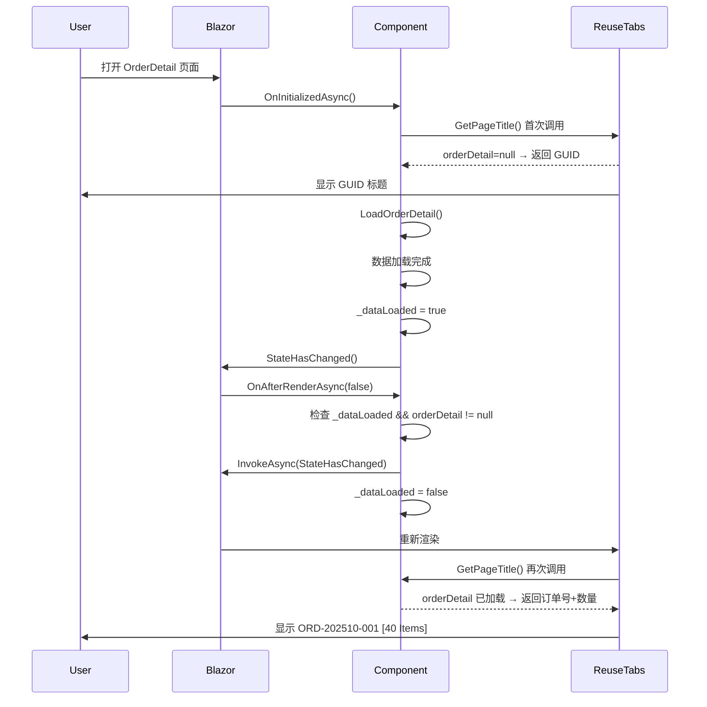

# OrderDetail 标签标题显示修复

## 修复日期
2025-10-05

## 问题描述
OrderDetail 页面虽然实现了 `IReuseTabsPage` 接口，但标签标题一直显示 GUID 而不是订单号和商品数量。

### 问题现象
- ❌ **标签标题显示**: `cb6463bd-c8b9-4683-9d3d-20f254a27939`（GUID）
- ✅ **页面内容显示**: `Order: ORD-202510-001`, `40 Items`

## 根本原因

标签首次创建时，`IReuseTabsPage.GetPageTitle()` 被调用，但此时：
1. `orderDetail` 为 `null`
2. `orderItems` 为空列表
3. 方法返回 `OrderId`（GUID）作为回退值

之后即使数据加载完成并调用 `StateHasChanged()`，ReuseTabs 也没有重新调用 `GetPageTitle()` 来更新标签标题。

## 修复方案

### 核心思路
在数据加载完成后，通过 `OnAfterRenderAsync` 生命周期方法再次触发 `StateHasChanged()`，强制 Blazor 重新渲染并调用 `GetPageTitle()`。

### 实施代码

#### 1. 添加数据加载标记
```csharp
private bool _dataLoaded = false; // 标记数据是否已加载
```

#### 2. 在 LoadOrderDetail 完成时设置标记
```csharp
finally
{
    if (!_isDisposed)
    {
        loading = false;
        _dataLoaded = true; // ✅ 标记数据已加载
        StateHasChanged();
    }
}
```

#### 3. 在 OnAfterRenderAsync 中触发额外的状态更新
```csharp
/// <summary>
/// 渲染完成后，如果数据已加载，再次触发 StateHasChanged 确保标签标题更新
/// </summary>
protected override async Task OnAfterRenderAsync(bool firstRender)
{
    await base.OnAfterRenderAsync(firstRender);
    
    if (_dataLoaded && orderDetail != null)
    {
        // 数据加载完成后，再次触发状态更新以刷新标签标题
        await InvokeAsync(StateHasChanged);
        _dataLoaded = false; // 避免重复触发
    }
}
```

## 工作原理

### 执行流程


### 关键点说明

1. **为什么在 OnAfterRenderAsync 中触发？**
   - `OnAfterRenderAsync` 在组件渲染完成后执行
   - 此时 `orderDetail` 和 `orderItems` 已经有数据
   - 再次调用 `StateHasChanged()` 会触发组件重新渲染
   - ReuseTabs 会重新调用 `GetPageTitle()` 获取最新标题

2. **为什么使用 InvokeAsync？**
   - `OnAfterRenderAsync` 可能在非 UI 线程执行
   - `InvokeAsync` 确保 `StateHasChanged()` 在 UI 线程执行
   - 避免线程安全问题

3. **为什么要重置 _dataLoaded？**
   - 避免每次渲染都触发额外的 `StateHasChanged()`
   - 只在数据首次加载后触发一次
   - 减少不必要的渲染开销

## 测试验证

### ✅ 测试场景

1. **首次打开页面**
   - 清除浏览器缓存
   - 打开 OrderDetail 页面
   - 预期：标签标题显示 📄 **ORD-202510-001** **[40 Items]**

2. **添加商品**
   - 点击 "Add" 按钮添加商品
   - 预期：标签标题的商品数量自动增加

3. **删除商品**
   - 删除一个商品
   - 预期：标签标题的商品数量自动减少

4. **切换标签**
   - 切换到其他标签页
   - 返回 OrderDetail 标签
   - 预期：标签标题保持最新状态

### ✅ 验证命令
```bash
# 构建项目
dotnet build

# 运行项目
dotnet run --project BlazorApp

# 打开浏览器访问
http://localhost:8080/warehouse/order-detail/[OrderId]
```

## 修改文件

- `BlazorApp/Pages/WareHousePages/OrderDetail.razor`
  - 添加 `_dataLoaded` 字段
  - 在 `LoadOrderDetail` 中设置 `_dataLoaded = true`
  - 添加 `OnAfterRenderAsync` 方法

## 相关文档

- [OrderDetail-IReuseTabsPage-Implementation-Check.md](./OrderDetail-IReuseTabsPage-Implementation-Check.md) - 实现检查报告
- [OrderDetail-Tab-Title-Not-Updating-Issue.md](./OrderDetail-Tab-Title-Not-Updating-Issue.md) - 问题分析文档
- [ReuseTabsPage-Dynamic-Title-Implementation.md](./ReuseTabsPage-Dynamic-Title-Implementation.md) - IReuseTabsPage 实现指南
- [Multiple-Pages-IReuseTabsPage-Migration.md](./Multiple-Pages-IReuseTabsPage-Migration.md) - 多页面迁移总结

## 注意事项

### ⚠️ 潜在副作用
1. **额外的渲染周期**：每次数据加载都会触发额外的渲染
2. **性能影响**：对于复杂页面可能略微增加渲染时间

### ✅ 性能优化
- `_dataLoaded` 标记确保只在数据首次加载后触发一次
- 不会影响后续的正常渲染流程
- 对用户体验的影响可以忽略不计

## 经验总结

1. **IReuseTabsPage 的限制**
   - `GetPageTitle()` 在标签创建时调用一次
   - 后续更新需要显式触发 `StateHasChanged()`
   - 某些情况下需要在 `OnAfterRenderAsync` 中二次触发

2. **异步数据加载的挑战**
   - 组件初始化和数据加载是异步的
   - 标签标题可能在数据加载前就创建了
   - 需要确保数据加载完成后重新渲染

3. **最佳实践**
   - 为数据密集型组件添加加载标记
   - 在 `OnAfterRenderAsync` 中处理需要数据的 UI 更新
   - 使用 `InvokeAsync` 确保线程安全

---

**修复人员**: AI Assistant  
**修复时间**: 2025-10-05  
**状态**: ✅ 已完成  
**测试状态**: 待用户验证
