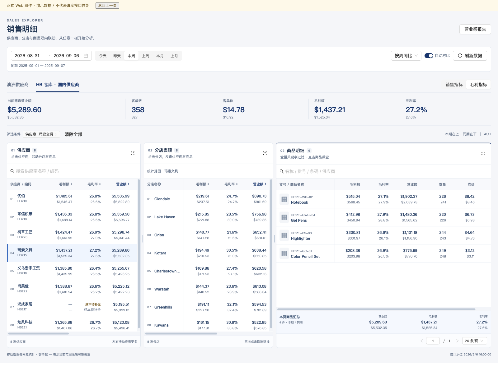
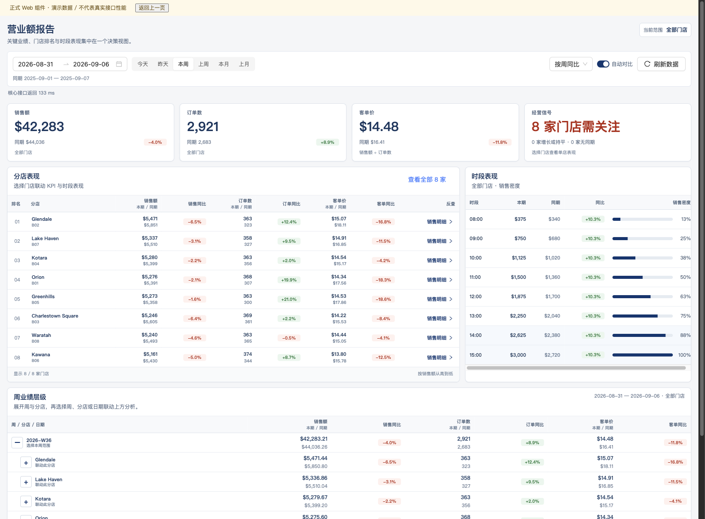

# 销售明细与营业额 Web 落地

本目录记录 2026-09-06 的正式页面实现和验收边界。截图来自正式 React 组件的隔离演示入口；黄色提示明确标注演示数据。它们不是生产数据或生产性能证据。

## 页面与预览

- 正式销售明细路由：`/executive-sales-intelligence/sales-detail-v2`
- 正式营业额路由：`/executive-sales-intelligence/overview`
- 开发演示入口：`apps/web/dev/report-preview/index.html`
- 本次本地服务：`http://127.0.0.1:5186/dev/report-preview/index.html?kind=china`
- 营业额演示：同一入口增加 `page=overview`；英文增加 `lang=en`。

从 `apps/web` 运行 `npm run dev -- --host 127.0.0.1 --port 5186` 即可打开。演示入口不在生产路由/构建入口中，仅拦截该独立页面中的请求；正式路由仍使用真实 API，不依赖演示数据。





## 落地功能

销售明细采用左供应商、中分店、右商品的三栏结构，澳洲与 HB 仓库国内供应商分标签。供应商、分店、商品均可反查另外两栏；各栏忽略自身选中维度以保留候选，顶部汇总使用所有选中维度的交集。支持逐项清除、全清、供应商局部搜索、商品全量多词搜索、分页、栏宽拖动/键盘调整、单栏展开与 Escape 收起。

毛利额、毛利率、销售额、数量、均价、客单数/客单价、份额采用移动端报告口径。本期与同期上下排列；成本不完整显示 `— / 成本待补全`，不转成零利润；跨商品或跨供应商无法可靠去重的客单数返回 null，不将店数或商品订单之和冒充客单数。

营业额包含 KPI、分店排名、小时表现和周/分店/日期层级。选择分店联动 KPI、小时和周层级，点击日期回写主查询范围；反查销售明细保留日期、分店、同比开关与同比方式。周范围按 ISO 周边界与查询范围相交，不依赖有销售日期的最小/最大值。

两个页面均支持中英文、窄屏布局、独立加载/重试、30 秒用户与授权范围隔离缓存、前端旧请求取消、陈旧响应隔离、Pending 有限重试及超过 3 秒的明确提示。页面保活隐藏后停止发起新请求，切回保留有效交互状态。

## 接口边界

- 销售明细新增只读 `GET /api/react/v1/dashboard/sales-detail-columns`，按 `section=suppliers|branches|products|summary` 独立查询。
- 营业额复用 `executive-branch-performance`、`executive-hourly-traffic` 和 `weekly-performance-hierarchy`。
- 周接口补充服务端权限/分店范围、显式比较日期、完整性状态和版本缓存；本期/同期独有的日期与分店均参与统计。
- 供应商汇总优先复用移动端已发布统计，产品筛选在数据库聚合、全局排序后分页；宽泛的历史映射查询使用 JSON 集合参数，不把全部商品编号展开为数千个 SQL 参数。
- 完整性检查覆盖本期/同期最长 366 天；缺日或三类统计版本不一致保持 Pending，不缓存为 Fresh。该状态校验不放宽原后台刷新任务的 35 天分段限制。
- 未部署、未提交、未修改生产数据库/统计配置、未重建统计或发布移动端更新。原有移动端、导航和版本管理改动保留。

## 已观察的浏览器验证

- 分店反查仅触发供应商、商品、汇总查询；商品反查仅触发供应商、分店、汇总查询。
- 多词搜索、清除关键字保留选中商品、纯空白关键字、中文 IME 组合期间不查询，组合结束后查询。
- 连续输入 `Notebook → HB215`：旧商品/汇总请求中止，新结果保留。
- 商品栏错误时不残留旧商品行，其他栏可用；局部重试只请求 `products`。
- Pending 不显示成有效空数据；进入 Fresh 后才显示数据。
- 关闭同比后不发送比较日期，界面同期为 `—`。
- 可见同比控件切换 ByDate 后，快捷日期继续发送 ByDate。
- 选店后小时与周查询均发送该分店范围；周/店/日钻取与跨页查询参数正确。
- 供应商标签写回地址；KeepAlive 切页返回保留 China 标签和选中供应商。
- 390px 窄屏无页面横向溢出，1280px/1600px 桌面三栏，英文标签和数字可读。

## 性能验收：尚不能声明生产 3 秒达标

生产旧移动端同源接口只读观测，区间 `2026-08-31..2026-09-06`，比较 `2025-09-01..2025-09-07`：

| 接口 | 本轮观测首轮耗时 | 返回 |
| --- | ---: | --- |
| executive-branch-performance | 4,851 ms | HTTP 200，28 行 |
| china-supplier-sales-rank | 4,317 ms | HTTP 200，Fresh，188 行 |
| enhanced-sales-product-details | 4,586 ms | HTTP 200，Fresh，20 行 / 总 8,405 |
| china-supplier-sales-rank 相同查询再读 | 513 / 305 ms | 两次均 Fresh，188 行 |

首轮只是本轮第一次观测，不能证明真正冷缓存；后两次也只是两个样本，不是 p95。新三栏后端尚未部署，因此以上不代表新接口性能。演示入口的约百毫秒结果不计入 3 秒验收。

正式组件记录 `performance.measure('hb-report:<区域>:data-painted')`，从该区域开始查询到 Fresh 数据状态更新后两帧，不把骨架屏或 Pending 当作首批数据。该时长不包含之前的登录与路由模块下载；完整首访还需从浏览器导航起点另行测量。

真实验收需在授权环境部署后，分别记录全店今天/本周/本月、国内/澳洲、选店反查、宽泛关键字和快速切换：导航到首批真实数据、全部首屏区域就绪、API 耗时及统计状态。冷/热场景分别多次采样计算 p95；3 秒以内收到错误或空壳不算达标。

营业额复用的旧分店/小时服务本轮没有贯穿到数据库的取消令牌；已验证的是客户端中止与不被旧回包覆盖。新销售明细共享查询按等待者计数：单个请求取消不影响其他等待者，最后一个请求离开后取消共享计算并摘除该代查询。共享预算为协作式 10 秒，新主库作用域单条命令上限为 8 秒并在结束时恢复；这些都不是 3 秒达标证据。旧 POSM 映射/目录读取未完整贯穿取消令牌和该命令上限，仍可能继续执行。生产读写锁等待与 SQL Server 查询计划需上线环境核验。

## 本地自动化证据

- 7 组新增前端脚本按 CI 的 `web-esbuild` 方式全部通过（日期/数值、销售明细派生、请求、结构契约，营业额派生、请求、结构契约）。
- 完整 Web TypeScript 检查通过。
- `npm run build -- --mode development` 通过；这是开发模式编译，不是可发布生产产物。
- 默认生产模式构建需要中心日志发布配置。本次没有读取或复制真实凭据，也没有修改 `.env`；不使用占位配置的构建产物发布。
- 后端统一回归 **374/374 通过，0 失败，0 跳过**，耗时 22 秒，包含销售明细/营业额口径、供应商统计、全局商品分页、中国供应商映射、周层级、授权元数据、共享查询并发取消和架构契约。
- 共享查询先观察到 2 项取消/旧代复用失败，再修复至 6/6；长区间状态追加覆盖 36 天、366 天及 367 天拒绝。测试使用本地 SQLite/受控夹具，不连接生产数据库，不代表 SQL Server 性能通过。
- 最终 `git diff --check` 通过。后端编译保留既有无关测试警告，没有因本任务新增构建错误。

后端组合复跑命令（仓库根目录；首次先去掉 `--no-build` 并使用 `--no-restore` 编译）：

```sh
dotnet test services/backend/BlazorApp.Api.Tests/BlazorApp.Api.Tests.csproj --no-build --filter 'FullyQualifiedName~SalesDashboardReportRevenueTests|FullyQualifiedName~WeeklyReportTests|FullyQualifiedName~SupplierReportReadTests|FullyQualifiedName~ProductReportPagingSqlTests|FullyQualifiedName~ProductReportChinaMappingTests|FullyQualifiedName~ControllerAuthorizationMetadataTests|FullyQualifiedName~SalesDetailQueryFlightsTests|FullyQualifiedName~GiantServiceArchitectureContractTests' --verbosity quiet
```

## 交付状态

本地正式代码、设计截图、可点击演示和专项回归已完成。尚未提交、推送或部署；线上首次真实数据 3 秒验收未完成。下一步需明确授权目标环境部署，再对真实接口/浏览器进行多轮冷暖场景计时；若未达标，继续依据查询计划和读锁证据优化，不以本地演示速度代替。
