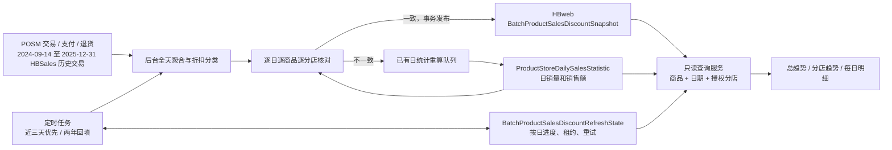

# 批量货号折扣统计解耦方案

## 目标与验收

批量销量页面从 HBweb 的 `BatchProductSalesDiscountSnapshot` 直接读取预计算结果。切换商品、日期范围、分店或刷新状态均不扫描 POS 原始交易，不创建折扣计算任务。独立后台任务持续维护近两年数据，服务重启后继续未完成日期。

验收以真实查询条件和数据库结果为准：已完成日的正价、折扣、未知数量与净销量一致，销售额与日统计按存储精度一致；一个日期缺失或异常不能屏蔽其他已完成日期；分店权限在读取服务端执行。刷新成功、任务启动和两年回填全部完成分别报告。

## 数据和依赖边界

1. **源数据适配层**：一次读取一天的所有商品和分店，遵循既有日统计的支付分摊、退货去重、设备分店回退及经核验的 HBSales 历史窗口规则。对订单、明细（含折扣金额、折扣率）、支付、退货原单证据、商品条码与供应商映射生成指纹，计算前后确认源数据未改变。支付分摊保留足够的小数位，跨 POSM/HBSales 按“日期、分店、商品、供应商”合并后统一四位舍入，与日统计实际落库粒度相同。
2. **后台调度与发布层**：按日领取持久化任务，使用运行实例门禁、全局租约和日期 token 防止重复工作及旧执行器提交。只有数量、金额和数据版本核对通过后才发布。
3. **查询层**：只读取 HBweb 日统计、折扣快照和覆盖状态；根据当前账号可见分店过滤预计算结果。按已完成日期组合响应，未完成日期保留可靠净销量和销售额，折扣列标明未完成。
4. **页面层**：保持现有商品列表、两幅趋势图、每日明细和右侧分店排名；状态提示明确区分回填中、部分就绪、后台更新和统计不一致。后台巡检期间，只要已提交代际仍通过版本与日统计核对就继续显示，并返回 `Refreshing`；首次回填没有已提交结果时仍保持未知。页面轮询仅重新读取，不触发计算。

## 表结构与兼容

`BatchProductSalesDiscountSnapshot` 新增 `SnapshotFormat`，默认 `1` 保留旧的查询组合快照。格式 `2` 使用稳定的“日期 + 商品”主键，`StartDate = EndDate`，`PayloadJson` 保存该商品该日所有分店聚合值，逻辑粒度仍为日期、商品、分店。读取索引为商品和日期，换查询组合可重复利用同一份结果。旧格式不作为新读取路径的候补结果。

`BatchProductSalesDiscountRefreshState` 保存日期覆盖、规则版本、源指纹、日统计销售字段指纹、完成时间、检查时间、租约 token、重试次数及错误。零交易日期仍保存已完成状态，避免把“确实为零”和“尚未回填”混为一谈。当天全部商品快照与状态在同一事务提交，读取端验证快照和状态版本一致。

生产只读核验发现 2024-09-14 至 2024-12-31 的 HBSales 明细约 225 万行，原有仅限 2025 的来源判断会漏算。新增共享 `SalesStatisticsHBSalesHistoryWindow`，明确范围为 `[2024-09-14, 2026-01-01)`；ProductStoreDaily 的直接、单日队列、分店配对构建及后置水位核对接入同一规则，分店独立刷新、完整刷新、看板补缺和成本回填同步使用该边界，2024 也经过双表原子发布。旧 2025 批预载接口保持原范围。

已发布日期内，某个商品没有统计行和快照时，按该商品的零活动日处理；全天其他商品的快照数量不会影响它。未提交日期仍为未知；已有商品日统计行却缺少快照时仍视为异常，不能将缺失数据伪装为零。

日统计指纹只包含排序归一后的日期、商品、分店、数量和金额，不包含成本或更新时间。成本回填不能误触发折扣失效，也不能用成本回填时间证明销售金额已重新计算。

## 调度与两年回填

- 以系统统一的业务日期为准，自动维护从当天向前两年的日期任务；未完成日期持久化保存，按日期分批处理。
- 最近三天优先检查，目标检查周期五分钟；历史日期由近到远回填，已完成历史日期按日巡检，以最早检查时间优先轮转，未完成历史回填优先于巡检。任务耗时、实例暂停或数据库不可用会增加实际延迟，页面不承诺交易级实时。
- 数据指纹和日统计销售字段指纹均未变化时，只更新检查时间，不重新聚合折扣。指纹检查仍读取当天源记录，用于发现没有更新时间的历史修正；这项工作仅由后台执行。计算过程中发生变化则延后重试。同一次计算复用已准备的源范围，只做计算前、后两次完整指纹扫描；POSM 全天聚合先物化并索引日期、商品及分店范围，避免原查询组合放大。
- 发现缺失日统计或数量、金额不一致时，后台复用现有日统计重算队列，仅重算对应日期；等待真实完成后重新核对，不放宽金额误差掩盖历史旧值。
- 等待日销量统计采用 `WaitingCanonical` 状态，每 30 秒复查且不消耗折扣计算失败次数；日销量任务失败或缺失时可有界重新入队。真正计算失败采用退避和持久化错误，连续五次失败后延长为一天冷却，保留自动恢复路径；服务重启后由过期租约接管，禁止旧 token 覆盖新结果。
- 每轮最多 12 个日期、总预算四分钟；仍有待办时五秒后续跑，空闲时每分钟检查。领取任务和待办判断在 SQL 中限定当前两年范围，过期历史数据保留但不继续巡检。

## 实施职责

| 负责人 | 文件边界 | 交付 |
| --- | --- | --- |
| GPT-5.6 Terra 源统计代理 | SourceReader、既有 FactReader 的公共口径、源 SQL 测试 | 全日聚合、源指纹、支付与退货一致性 |
| GPT-5.6 Terra 调度代理 | DailyStore、Worker、调度注册、任务测试 | 两年任务、日租约、原子发布、重试与近期优先 |
| GPT-5.6 Terra 查询代理 | SnapshotReader、AnalysisService、查询测试及页面状态 | 纯读取、权限过滤、按日部分展示 |
| 主代理 | 模型、SQL 迁移、集成测试、文档、发布 | 接口整合、真实 SQL Server 验证、审查及生产验收 |

## 发布与回退

先核对生产服务器、HBweb 数据库、基础快照表和当前运行版本，再运行 `services/backend/SqlScripts/BatchProductSalesDiscountScheduledSnapshots.sql`。该脚本只增加字段、表和索引；保留旧格式数据。发布前保留原 API 镜像、前端资源和配置回退点，不修改密钥与 DataProtection。

先确认新结构存在，再部署后台和相应页面状态处理。后台自动创建日期任务并持续回填。以覆盖日期数、失败日期数、最近完成时间，以及用户真实货号与分店筛选的返回结果检查效果。需要回退时停用新任务并恢复原 API/前端，保留新增表及数据，避免覆盖恢复数据库。

测试至少覆盖：查询不写队列、跨查询复用、分店权限、零交易日、部分缺失、损坏快照、规则版本不一致、日统计金额不一致、支付分摊和退货口径、租约争抢、过期接管拒绝旧提交、原子发布失败回滚和迁移重复执行。
