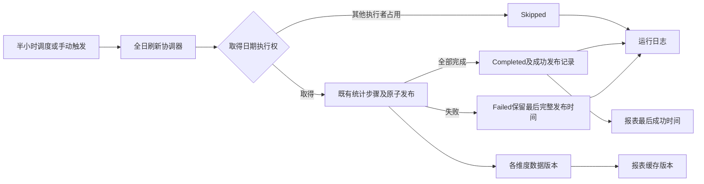

# 销售统计执行、发布与新鲜度解耦方案

**目标：** 避免统计任务中断后连续两小时跳过刷新，以及“任务未执行却显示最近统计已更新”的事故。发生失败时保留最后一次可证明的数据发布时间；新执行者只能在旧写执行者已失去执行权后接管。

**实现思路：** 分离执行结果、日期执行互斥、数据发布记录三个边界，复用现有统计表和状态表，不增加外部消息队列或数据库 schema。本轮由 `gpt-5.6-terra` 原生子代理实现，主代理整合并独立审查、验证。

**约束：** 使用独立工作树 `/Users/sean/DEV/hb-platform-statistics-recovery-20260914`，分支 `codex/statistics-recovery-20260914`，基准 `f2bd44b3785a431b10121bd1cf0da9856be5c524`。保留原工作区所有用户改动。当前任务完成代码与测试，不将本地实现等同生产发布。生产切换必须遵循下文运行约束及原生产 runbook。

## 事故与影响范围

2026-09-14 16:00（Brisbane）全日刷新未完成，留下 `DailyStatisticsAlignmentFullRefresh/2026-09-14` 的 Running 租约；16:30、17:00、17:30、18:00 被跳过，却记录 `UpdateCurrentHourStatistics / Success`。移动端使用任务成功日志显示“最近统计18:00”，实际 Orion 16/17 点的统计行不存在，25家门店日汇总停在15:31。原始收银数据完整。

主要调用链为 `ScheduledTaskService → SalesStatisticsJobService → SalesStatisticsApplicationCoordinator → SalesStatisticsStoreDailySlice → SalesStatisticsOrchestrationSlice`。共享日期租约还服务商品持久队列和历史商品补算；租约改动风险高，不能全局缩短 TTL。

codebase-memory 调用图已辅助定位。原仓库 GitNexus 索引为9月9日 `cc88b6d`，与当前基准不一致，且图内包含部署产物副本；因此以基准源码、精确调用点及相关测试完成影响复核，不把过期图中的副本数量当作真实影响范围。

独立工作树曾在R1阶段成功生成codebase-memory索引；R2收尾重新索引返回Transport closed，因此最后一轮采用实际diff、新文件完整源码、精确调用点与独立审查替代最终图分析，不声称旧图覆盖最终改动。

## 三个边界

### 1. 执行结果不能由是否抛异常推断

- `FullRefreshCurrentDay`、`FullRefreshPreviousDay` 返回明确的 Completed/Skipped 结果；组合任务任一日期跳过，整体不能记为全部完成。异常继续传播失败原因。
- 调度层只对 Completed 写 Success；Skipped 单独严格落库，不推进成功时间。全跳过不清缓存；部分日期或步骤真实写入后的缓存失效与任务终态分别处理，不能因最终失败而继续缓存旧数据。
- 日任务、重试、手动 HTTP 等调用点全部检查；保持原 HTTP 响应结构兼容，准确传递结果语义。
- 重试必须复用相同的完整刷新入口；`FullRefreshCurrentDay` 日志既然允许重试，重试分派必须支持该任务类型。运行指标与移动端状态解析都识别 Skipped，不能归成 Failed 或隐藏。
- 当前半小时只刷新当天、历史夜间补算规则保持有效。

预计文件：`SalesStatisticsStoreDailySlice.cs`、`SalesStatisticsApplicationCoordinator.cs`、`SalesStatisticsJobService.cs`、`ScheduledTaskService.cs`、`ScheduledTaskLogService.cs`、结果类型和有关控制器/重试调用点。

### 2. 数据发布时间独立于调度日志

- 使用现有 `SalesStatisticRefreshState` 中专用的成功发布类型记录实际完成；只在真实全日完成后更新。Running/Skipped/Failed 不覆盖这一记录。
- 发布写点放在每个日期的协调器成功分支内、仍持有执行权且尚未完成租约时。自动、手动、周任务与对齐补算共用该写点。报表当天页头只读取当天业务日的发布记录，昨天或历史补算不推进今天的时间。
- 现有 `UpsertStatisticStateAsync` 会对所有非 Running 状态推进 `LastAggregatedAtUtc`，包括 Failed，必须改为仅成功发布状态推进。
- 页面最后成功时间读取发布记录；没有可证明发布记录时返回未知，不把历史误写 Success 回填为新时间。
- 最新运行状态可继续表达 Running/Skipped/Failed，不能与最后成功时间混为一个字段。
- 缓存版本依赖各维度真实提交版本，覆盖当日和历史/局部重算；不能只看一个最小时间或最新调度调用。指纹查询应使用紧凑分组/限定范围，避免在请求热路径读取所有状态行。
- 缺数据、空营业日、某一步成功而后一步失败都需明确测试；保留商品及供应商暂定状态的现有语义。
- 此标记证明某日上次八维均完成的时间；本轮没有把八维表改成一个跨表快照事务。各步骤已经提交的更新不会因为后续步骤失败而整体回滚，各维度缓存依然按自己的真实提交版本失效。

预计文件：`SalesStatisticRefreshState.cs`、`SalesStatisticsProductStoreDailyStateSlice.cs`、`SalesStatisticsOrchestrationSlice.cs`、`SalesDashboardReactService.cs`、对应报表测试。

### 3. 日期执行权与两小时超时分离

使用领域专用 SQL Server Session applock guard，锁资源按 HBweb 数据库和日期隔离，Exclusive/Session，尝试获取不等待。必须由实际执行统计写入的同一数据库连接持有锁。

生命周期：固定写会话 → 获取日期锁 → CAS取得租约 → 统计计算及写入 → 发布完成 → 完成租约 → 释放日期锁 → 关闭会话。

- guard 内关闭 SqlSugar 自动关连接、SqlClient 透明重连和重试；识别连接对象、连接标识与服务端会话。
- 断连后该 guard 永久失效，旧执行不能重连继续写数据，也不能用失败状态覆盖新执行者的状态。
- 检查普通 SQL、事务和 BulkCopy 均绑定实际持锁连接。只在额外连接持锁不满足要求。
- Busy 才返回 Skipped；数据库断连、死锁和获取失败须返回 Failed。
- 现有成本写入事务锁与2025 global → date锁顺序保持；当天/2025的门店、商品、供应商共同发布事务保持。

新租约使用可识别 token 前缀（如 `sqlsess1:`），长度不得超过现有50字符限制。新协议使用远期 `LeaseUntilUtc` 哨兵，表示执行权由Session锁决定，防止旧程序按原两小时到期逻辑抢占。普通获取不得抢占Running的新协议行；只有已取得日期Session锁的guarded获取可以匹配旧token做CAS接管。续租保留新协议哨兵；完成仍要求owner与完整token匹配。

运行数量、运行租约列表及对齐页面的Running判定也必须识别该协议：sqlsess1行保留用于接管，不代表实际会话仍存活。读侧以对应日期Session锁是否仍持有为准；失锁遗留行不能永久占据“运行中”，否则Web对齐页面会阻止选择该日期补算。仍活跃的持锁会话必须保留Running可见性，不能简单排除所有哨兵行。

新协议先覆盖本事故的全日自动/手动刷新路径；商品持久队列和历史商品补算保持原协议并安全跳过被新协议占用的日期。它们不因此获得快速恢复能力。旧无前缀Running无法通过新Session锁证明执行者已退出，禁止提前回收。

会话锁负责证明旧写会话已退出，不能强制结束仍存活的慢查询。本轮没有缩短既有 POSM 查询超时，也不承诺活跃但卡住的源查询能立即恢复；其后续优化需要独立的取消传播及查询性能证据。

预计文件：新增 `Common/SalesStatisticsDateExecutionGuard.cs`、`ScheduledTaskLeaseService.cs`、`SalesStatisticsOrchestrationSlice.cs`，以及真实 SQL Server 集成测试。

## 本轮实施与验证

- [x] 类型化完成/跳过结果贯通所有调用点。
- [x] Skipped独立记录，不发布新成功时间或完成缓存版本。
- [x] 成功发布记录与失败状态更新时间修正。
- [x] freshness与缓存使用数据发布版本，覆盖历史补算与最后可用快照。
- [x] Session guard、兼容租约协议及旧执行失联后禁止发布。
- [x] SQLite/单元回归：完成、跳过、异常、空日、缺状态、失败保留旧水位、历史缓存失效。
- [x] SQL Server回归：同日互斥、不同日并发、会话终止接管、旧token失效、旧版TTL查询不能抢新协议、有效旧租约不提前回收。
- [x] SQL Server故障注入：事务写入后KILL，BulkCopy/Commit/Rollback作为首次后续动作，旧普通SQL及租约状态写入被拒绝，事务行未提交，清理不掩盖原故障。
- [x] 既有当天/2025原子发布、商品队列ownership、调度、报表回归通过，后端构建通过。
- [x] Running读侧按实际Session锁区分活跃执行与遗留接管记录。
- [x] 独立 `code-reviewer` 检查最终diff和证据，修复有效问题后完成最终范围检查。

测试使用本机隔离 SQL Server 2022 容器 `hb-statistics-recovery-sql-20260914`，仅监听127.0.0.1:15438。测试连接秘密通过任务私有0600文件传递，禁止写入代码、日志或提交。新测试须显式列入 `BlazorApp.Api.Tests.csproj`，因该项目关闭默认测试文件包含。

收尾已确认测试SQL实例没有残留用户数据库，核对容器ID后仅移除本任务创建的容器，并删除本任务生成的临时连接凭据。保留测试日志、TRX及代码验证指纹；未修改生产数据库或运行容器。

已经读取并核验的后端TRX为363项主定向测试、5项对齐后台测试、48项对齐/队列/ownership测试，共416项通过且无失败或跳过。后端测试项目Rebuild为0错误、11条既有警告。移动端 `statistics-freshness.test.ts`、locale parity、`tsc --noEmit`、相关TS/TSX的ESLint全部通过。

运行状态与Skipped重试标志的最后修正后，另外重跑对应48项及17项测试，均通过（它们是前述416项的子集，不重复计数）。主代理核对当前文件SHA-256与SQL/移动验证记录一致，后端源文件均早于测试所用DLL构建时间，最终diff检查通过。

SQL最终为10项通过、0失败、0跳过（18.016秒），包括运行计数/列表的活跃→失锁遗留→继任接管语义，分别用观察连接和持锁连接验证。测试曾真实检出BulkCopy异常关闭回调的漏洞，修复后保留原断言再次通过。故障注入均在BulkCopy/Commit/Rollback调用前KILL写会话，没有测试传输过程中的部分批次断网、连接池故障、超大批量性能或完整生产编排。RetryService复用了被覆盖的类型化入口，但未单独建立重试服务单测。这些边界不能用构建成功代替。

独立原生 `code-reviewer` 对冻结diff、调用点及证据完成审查：无遗留P0/P1/P2阻塞。第二路DeepSeek没有可调用接口，未计入已执行审查。实现与SQL测试分别由两位 `gpt-5.6-terra` 原生子代理完成；所有子任务结果已收回。当前原生接口不提供关闭或归档操作，没有删除会话文件或记录。

## 部署与回滚条件

1. 固定经过审查和测试的提交，保留生产镜像与代码备份；只读核对活动调度实例、实际容器、所有相关Running租约及写会话。
2. 首次切换前停止旧统计执行并确认旧写事务结束。旧无前缀租约只能在执行者已退出的证据和精确备份下处理，不能凭固定实例名、pid=1或心跳猜测。
3. 启动新版本后验证同日只一个执行者、真实Completed发布、Orion及全部25店源数据/日表/分时表对账。进程存活和health不代表业务恢复。
4. 回滚旧版本前，由新版本完成或在确认持锁会话退出后精确处理新协议Running租约；旧程序不会理解远期哨兵，不能直接回滚后等待TTL恢复。
5. 本方案不需要修改数据库schema，也不授权广泛清理生产任务记录或重算历史月份。

## 后续演进边界

可以进一步把 Daily/Hourly 快任务与 Store+Product+供应商慢任务分离，但这需要独立来源水位、发布版本、互斥范围及查询展示契约。本轮先修复可证实的执行与状态故障；不拆开现有门店/商品/供应商共同事务，避免引入快任务被旧慢快照覆盖的问题。

独立复核另外发现：既有 `EnumerateReportDates` 对超过35天返回空集合，部分长区间读接口可能把缺统计误判为不需要补算。此问题早于本轮改动，属于独立的长区间查询完整性问题；本轮不修改该查询范围契约，不将本次当日统计修复表述为所有历史长区间均已修复。

## 外部语义依据

- SQL Server Session applock 的会话释放语义：[Microsoft sp_getapplock 文档](https://learn.microsoft.com/en-us/sql/relational-databases/system-stored-procedures/sp-getapplock-transact-sql?view=sql-server-ver17)。
- SqlClient的连接恢复可能透明重连，故本执行上下文必须禁用该行为：[Microsoft.Data.SqlClient 文档](https://learn.microsoft.com/en-us/sql/connect/ado-net/microsoft-ado-net-sql-server?view=sql-server-ver17)。
- 批量写入切换SQL回调开关的实现参见 [SqlSugar 官方 FastestProvider 源码](https://raw.githubusercontent.com/DotNetNext/SqlSugar/master/Src/Asp.NetCore2/SqlSugar/Abstract/FastestProvider/FastestProvider.cs)。该链接是当前上游分支，实际已安装版本的行为以本轮SQL故障测试为准。

上述外部语义不能替代使用本项目实际SqlSugar版本的故障注入验证。

## 实施中的驱动验证记录

主代理在本机SQL Server 16.0.4275.2、SqlSugarCore 5.1.4.198、Microsoft.Data.SqlClient 6.1.1上执行独立探针：

- 固定连接下普通SQL和`Fastest.BulkCopy`使用相同SPID/ClientConnectionId，Session applock仍为Exclusive。
- `KILL`写SPID后，首次INSERT抛SqlException，但客户端State仍为Open且连接ID尚未变化。
- 即使`IsAutoCloseConnection=false`和`ConnectRetryCount=0`，第二次通过同一SqlSugar客户端INSERT仍成功；观察者看到新写入，而旧Session锁已释放。
- 清理时SqlSugar.Dispose还会因旧事务已经失效而抛异常，不能让这类清理异常掩盖主错误。

因此“只禁自动重连”不满足验收。实现必须捕获第一次数据库失效并永久禁止该guard/context继续写入，尤其阻止catch路径的Failed状态更新重连覆盖继任者。上述探针是旧行为的失败复现，不是修复通过证据；测试数据库已删除，容器保留供正式集成测试。

正式故障测试又检出了驱动回调的绕过路径：SqlSugar `FastestProvider.Begin` 将 `Ado.IsEnableLogEvent` 设为false后直接调用 `OnLogExecuting`，失败路径没有finally还原。因此guard必须在该回调第一步恢复检查启用状态，再验证会话；失效处理也需恢复该开关。验收必须包含BulkCopy首次故障后再次普通写入和失败状态更新，并由独立观察连接确认旧数据没有落库，不能仅断言首次异常。

## 生产只读恢复核验

2026-09-14 18:37 左右回读，旧程序18:30的自动任务于18:32:39完成（159.129秒），Orion分时16点为418.72/35单、17点为179.70/13单；门店日汇总为4835.39/323单，与原始订单支付聚合一致。25条门店日汇总均已在18:31:00.983更新。此恢复来自旧租约到期后原调度执行，不是本分支部署结果。

按本次快照共同来源水位 `2026-09-14 18:29:14.740 POSM_LOCAL` 对账，25/25店一致：5300单、60592.15。首次实时对账中2010的2单/9.49差额，分别来自18:30:49.557上传的3.99和18:37:01.370上传的5.50，均晚于快照来源水位；不是此次缺数残留。
