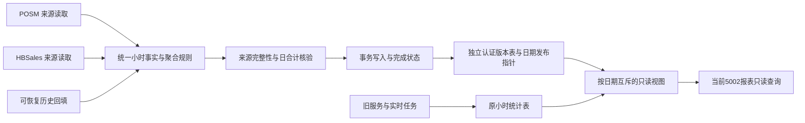

# 分时统计解耦与近一年回填方案

日期：2026-09-15。范围：2025-09-15 至 2026-09-14，含首尾完整营业日，所有存在销售事实的分店。本日实时统计仍由实时任务维护。

实现基准：fetch 后 `origin/main` 的 `e8fda248d802f24584eb0352499b689fe18e6824`，隔离工作树 `/Users/sean/DEV/hb-platform-hourly-statistics-backfill-20260915`。原工作树保留在 `1903e4843`，其用户改动不合入任务。实现基准不代表生产部署版本。

## 问题与验收

Glendale（1012）2025-09-15 日汇总在界面显示约 4,283 元、300 单，分时同期全为零。代码确认日统计在 2025 年包含 POSM 和 HBSales，日常小时重算仅查询 POSM；分时接口对缺行填零。生产只读样本已确认历史源数据存在，缺失统计不能当作零销售。

完成标准：范围内逐分店逐日的小时金额和单数与同口径原始事实核对；日汇总差异须列明原因，不为通过核对改写日汇总。缺失时间、来源不可用、缺失日汇总、重复或无法确定最终结账小时的订单必须列为阻塞项。报告已扫描、已完整、已回填、真实无销售、失败与无法重建的数量，不用“任务运行成功”替代数据验收。

生产只读样本已由 READ COMMITTED 独立重读确认：1012 / 2025-09-15，日统计金额 `4282.81`、数量 `1124`、订单 `300`，小时表 `0` 行；HBSales 有 `826` 条有效明细、`300` 个订单，结账时间无空值，范围 `09:05:37` 至 `17:27`，金额与数量精确一致；POSM 为零单。该样本具备真实分时重建条件。全年覆盖的初筛数据尚待一致性读与来源口径复核，不作为 apply 清单。

## 职责与依赖

1. **来源读取**：各来源负责查询及标准化，遵循现有营业日、有效单据、退货符号和金额口径。返回来源、日期、分店、订单身份、真实小时、金额、数量及读取状态。查询失败不能转换为空集合。2025 年来源组合复用日统计政策，其他年份以当前业务规则为准。
2. **聚合规则**：纯计算，不查询数据库、不发起任务。订单身份必须包含来源与分店，并检查同一订单跨小时。缺失结账时间不能默认 00:00，不将日金额平均拆分。小时桶聚合金额和订单数，客单价由金额除以单数计算。
3. **覆盖与核验**：缺行不等于零。至少区分完整、有销售但缺统计、来源不可用、时间不可恢复及运行中；真实零必须建立在来源读取成功的证据上。完成状态绑定日期、分店、来源口径版本及源摘要，防止旧版本结果被误认作完整。
4. **写入**：构建候选结果后再开始短事务。核实当前发布指针未被其他回填改变，写入独立版本并原子切换日期指针。原小时表保留，由旧任务继续维护。源读取、核验失败保留原行。不能调用重建全部日/供应商/商品统计的全量入口来修复小时数据。
5. **回填执行**：独立于 HTTP 报表请求，串行小批次、限速、可恢复进度；记录范围、口径版本、备份位置、源摘要、前后摘要和失败原因。恢复时重新核验来源和目标，不能仅凭本地完成标记跳过。查询报表不得直接执行历史删除与重算。
6. **报表读取**：仅读取统计结果和覆盖状态，保持现有权限与分店范围。缺失同期返回可识别的不可用状态，不能伪装成零增长基数。前端缺失展示属于配套契约变更，需验证 Web/mobile 消费方；本方案不把尚未实施的契约宣称为已完成。

## 执行与恢复

- 先只读确认实际服务器、Web 统计库、POSM 与 HBSales 源库；凭据只从既有受控配置取得，不写入脚本、报告或日志。
- 首先核查 Glendale 1012 / 2025-09-15，再按日期批量统计全年覆盖、有效时间比例、源间重复及日小时差额。
- 保存原发布指针及新版本的行数、主键/范围和摘要；保留版本行作为可验证恢复依据。原小时表不被修改。
- 先对样本生成候选并核验，再逐日执行。多个回填执行器共享数据库租约与日期锁；旧实时写入使用独立原表，不依赖旧任务遵守新锁。
- 每批事务后独立重读验证，失败暂停该范围并记录，不盲目重试结果未知的写入。
- 回退只撤销或恢复本批日期的发布指针，先核对批次身份与摘要；存在后续发布则拒绝覆盖。不得回退其他统计类型。
- 结果报告将实现/测试、生产运行、逐日核对及客户端显示分别记录。

## 独立审查补充的实施门槛

1. **先验证存储隔离，再回填**：认证版本只写独立发布表。报表查询只通过按日期互斥的视图消费；旧服务继续写原表。必须先用真实 BulkCopy 与事务测试证明旧写入不能改变认证结果，再部署读模型和执行 apply。
2. **来源归属与重复裁决**：来源前缀用于避免不同来源订单号碰撞，不是跨来源业务去重证据。逐店逐日列出应读取的来源集合，并审计同业务订单是否跨库重复。无法裁决的重叠单隔离，不认证完整。现有日统计合计口径作为对账基准，不在此次小时补齐中静默改变；若发现日口径本身重复，要单列差异。HBSales 类型 3/4 的负金额与订单数沿用日统计；POSM 营业额使用 PaymentDetail（含退款），数量使用 SalesOrderDetail，订单使用 SalesOrder。商品净额的独立 SalesReturnRecord 不再叠加到收款口径，避免重复扣减。
3. **覆盖母集**：分店集合由分店有效期/源归属与现有日统计联合枚举，而非仅取当天有明细的分店。每个日期、分店、required-source-set、规则版本记录各源 success/empty/unavailable、行数和水位。要求的来源全部成功后才能判定真实零；某源失败时即使另一源有数据也不能完整。
4. **原子发布与恢复**：版本行、前一发布指针和新指针在同一日期锁及数据库事务中提交。候选计算在事务外完成，发布前重验源摘要与当前指针。回滚使用批次身份及写入后摘要进行 CAS，拒绝覆盖后续发布，旧小时表始终不改。版本与审计记录保留至业务验收，不自动删除。
5. **缺失契约粒度**：本期/同期分别记录每个分店请求区间的 expected/complete/missing 日期；多日区间缺一天也不能将部分合计作为完整同期。只有所需日期与来源完整时才输出增长率。配套契约测试覆盖 Web/mobile，避免缺失继续显示“新增”。

审查提出这些实施门槛不代表它们已编码或已在生产验证。发布与回填前逐项以测试和生产证据核销。

## 实现分工与交付状态

- 主代理：方案、边界、结果复核及生产写入协调。
- GPT-5.6 Sol 实现子代理：统一来源及小时补齐核心、回填运行器、回归测试。
- GPT-5.6 Sol 审计子代理：生产只读覆盖审计、原始时间与订单口径验证、执行渠道与备份建议。

此文档描述目标方案。具体实现范围、生产回填结果及未完成项由实际验证证据更新；文档本身不证明生产数据已补齐。

## 2026-09-15 生产切换核验补充

- 已确认全年覆盖母集为 8,966 个分店日，14 个分店日完全缺少小时行；40,070 条小时行的订单数字段为 NULL。逐日源重建候选尚待预览，不能将初筛数量直接当作可写数量。
- 独立 SQL Server 2022 测试确认：普通 UPDATE 被认证触发器以 51002 拒绝，但旧 `Fastest<HourlySalesStatistic>().BulkCopy` 不触发该 DML trigger；测试中认证日期从 2 行变为 3 行且触发器仍启用。因此禁止宣称数据库触发器独立保证旧实例混跑安全。
- 生产于 UTC 2026-09-14 21:53:42 已发生其他后端部署，当前 5002 容器为 `45d146bffe20`，镜像 `sha256:e659e57ae6fd0819318f24a4843764e2bb51cba095b402913ef0cb574ba5769e`。此操作不是本回填任务执行；发布前必须重新确认相关源码基线与完整发布范围。
- 只读检查确认旧 5001 容器 `05e8eb577d19` 与 5002 使用完全相同的 DefaultConnection。运行时调度控制仍指向旧实例 `05e8eb577d19-1`，UTC 22:12 的心跳有效；5002 的 `hbweb-vite-production` 心跳也有效。因此旧写入者尚未完成切换。
- 旧 5001 承载现有业务，保持运行；独立发布存储解决旧 writer 的覆盖风险，无需切换旧实例或调度控制。
- 截至上述核验，本任务未执行生产迁移、小时回填或生产配置写入。

## 最终解耦裁决：独立发布存储（替代原表围栏方案）

原表触发器不能拦截旧 BulkCopy，旧 5001 还承载 8888 的 API/任务页面，不能通过停旧服务来满足当前任务。故前文“所有旧 writer 必须升级才可 apply”的原表写入方案不再采用；以下结构替代该切换门槛：

- `HourlySalesBackfillPublishedRow` 保存批次内不可变小时版本，主键包含 `BatchId/Date/Hour/BranchCode`。原 `HourlySalesStatistic` 不被本次回填写入或回滚。
- `HourlySalesBackfillDay` 的唯一 `Applied` 日期记录作为发布指针。候选行及发布指针同事务提交，失败时保持上一版可见状态；回滚先核对发布版本摘要，再撤销/切换指针，版本数据保留用于审计。
- `HourlySalesReadStatistic` 按日期互斥选择：有 Applied 指针时只读取相应批次，其他日期读原表。发布为真零的日期即使没有小时行也压过原表；来源复核失败的已发布日期不回退旧表冒充完整。
- 当前 5002 的专用小时接口、营业额快照（ORM/SQL Server）、兼容小时接口及统计对齐读取统一使用该视图。发布批次、摘要和失效状态参与缓存版本；发布/回滚与读取使用一致性事务。
- 旧 5001 与 8888 路由保持运行和原有行为，本次不升级旧应用、不变更其反代。新认证结果在当前 5002 报表生效，不能宣称旧 8888 应用也已采用新读取契约。
- 验收增加：旧 BulkCopy 继续写原表时认证结果不变；混合已发布/未发布日期不重复；认证真零压过旧非零；来源失效不能复用此前完整缓存；SQL Server 与 ORM 读取口径一致；发布/回滚后原小时表摘要不变。

2025-09-15 首次真实来源只读预览：POSM 9,486 行、HBSales 8,226 行均读取成功，用时 114 秒；纯规则发现同一来源订单跨小时，拒绝发布并保留问题。只读诊断确认：3,216 笔 HBSales 订单中 5 笔明细跨小时，共 $144.11；全部订单均有唯一主表结账时间，日期及分店一致。实现将按真实主表最终结账时间归小时，保留唯一主表、日期、时间与分店校验。该日尚未发布，全年数据也尚未补齐。

主表小时版首日预览：241 条候选、订单数 5,339 完全一致；7 家店金额少 $91.91、数量少 15。源码复核确认新增商品补充退货与 PaymentDetail / SalesOrderDetail 日口径重复扣减，已要求撤销该叠加并增加退款不二扣测试；此结果仍未发布。

## 当前首日验收证据

撤销重复退货扣减后，2025-09-15 只读重建 VALID：241 条候选；金额 64,393.69、数量 16,908、订单 5,339，与日统计完全一致，issues 为空。Glendale 的九个小时合计 4,282.81 / 300 单。此阶段仍是只读候选，生产发布与全年验收尚待执行。证据：`outputs/hourly-source-preview-20260915/preview-2025-09-15-payment-basis.jsonl`。
